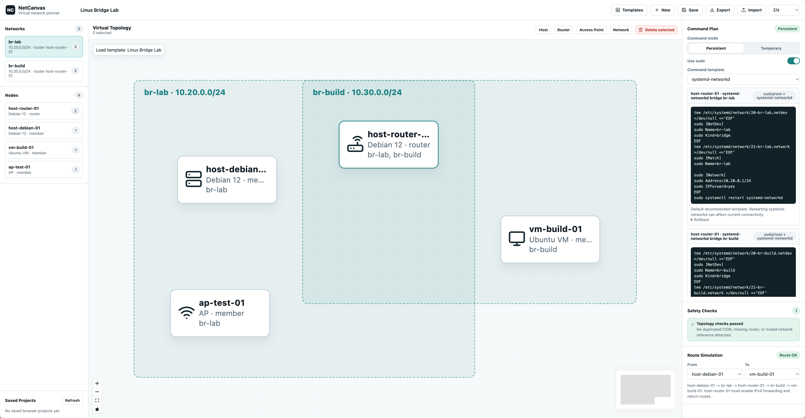

# NetCanvas

English | [简体中文](README.zh-CN.md)

## Introduction

NetCanvas is a virtual network planning workspace. It helps users design network topologies on a visual canvas, organize device and network relationships, review generated command plans, run basic safety checks, and simulate simple route paths. Its primary goal is not fully automated deployment, but helping users turn topology design into configuration references.

## Screenshot



## Features

- Infinite topology canvas with pan, zoom, box select, selection, and draggable nodes.
- Linux hosts, routers, access points, virtual devices, and bridge networks.
- Support for one node joining multiple networks.
- Command plan generation with temporary and persistent modes.
- Command templates for `systemd-networkd`, `iproute2-bridge`, and `NetworkManager`.
- Command grouping by host/device, with execution order, permission notes, risk notes, and rollback commands.
- Basic safety checks for CIDR conflicts, missing gateways, missing routes, and repeated interface names.
- Basic route simulation across shared networks and simple router traversal.
- Project data is saved in the local browser.
- Project import and export.

## Quick Start

Use Node.js `>=20.19 <21` or `>=22.12`.

```bash
npm install
npm run dev
```

The Vite dev server runs at:

```text
http://127.0.0.1:5173
```

## Build

```bash
npm run build
npm run check
```

`npm run build` runs TypeScript validation and creates the production output in `dist/`.

## License

NetCanvas is released under the MIT License. See [LICENSE](LICENSE).

## Future Extensions

NetCanvas can gradually expand to more network types, platforms, and planning targets:

- VLAN.
- NAT egress networks.
- Multi-subnet routing.
- DHCP/DNS services.
- Wi-Fi access points.
- VPN networks.
- Docker networks.
- Proxmox networks.
- OpenWrt.
- RouterOS.
- Kubernetes CNI planning.
- Windows and macOS network setup references.
- Enterprise network device configuration templates.
